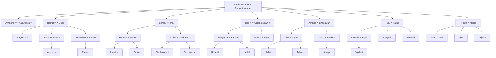

# Paliyath Family Tree — Diagram

Legend: † = deceased, ⚭ = married, ♡ = partner

```mermaid
graph TD
    G0["Raghavan Nair ⚭ Parukuttyamma"]

    G0 --> S1["Ammani † ⚭ Narayanan †"]
    G0 --> S2["Ramany ⚭ Gopi"]
    G0 --> S3["Sarasu ⚭ Unni"]
    G0 --> S4["Raji † ⚭ Omanakuttan †"]
    G0 --> S5["Ambika ⚭ Bhaskaran"]
    G0 --> S6["Raju ⚭ Latha"]
    G0 --> S7["Renjith ⚭ Meera"]

    S2 --> R1["Raghesh †"]
    S2 --> R2["Surya ⚭ Manish"]
    S2 --> R3["Vasanth ⚭ Adrianne"]
    R2 --> R2a["Anushka"]
    R3 --> R3a["Rowen"]

    S3 --> C1["Renuka ⚭ Manoj"]
    S3 --> C2["Chitra ⚭ Krishnadas"]
    C1 --> C1a["Ananthu"]
    C1 --> C1b["Gokul"]
    C2 --> C2a["Shri Lakshmi"]
    C2 --> C2b["Shri Nanda"]

    S4 --> J1["Manjasha ⚭ Haridas"]
    S4 --> J2["Manoj ⚭ Swati"]
    J1 --> J1a["Harshid"]
    J1 --> J1b["Hridith"]

    S5 --> A1["Abhi ⚭ Divya"]
    S5 --> A2["Anish ⚭ Reshma"]
    A1 --> A1a["Adwit"]
    A1 --> A1b["Adidev"]
    A2 --> A2a["Amaya"]

    S6 --> U1["Sreejith ⚭ Kajal"]
    S6 --> U2["Sreejesh"]
    S6 --> U3["Seehari"]
    U1 --> U1a["Vaidehi"]

    S7 --> E1["Ajay ♡ Aami"]
    S7 --> E2["Ajith"]
    S7 --> E3["Anjitha"]
```

Full details in [tree.md](tree.md).
